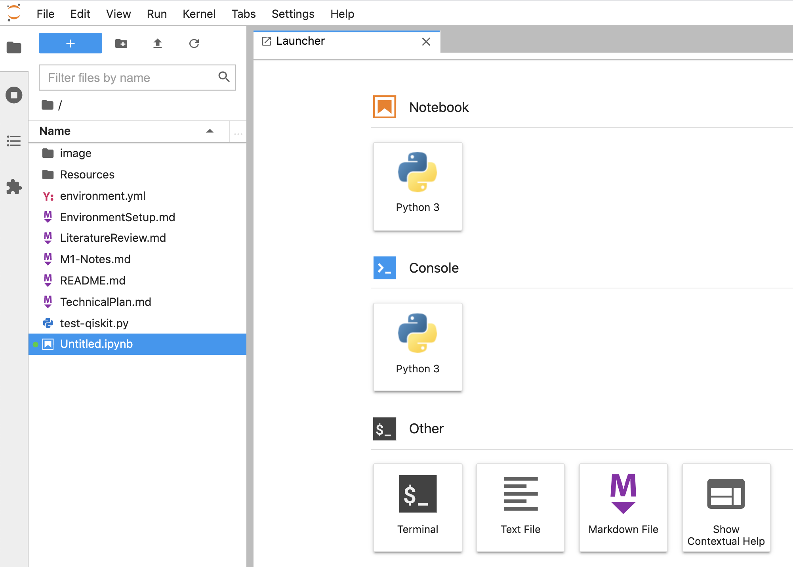
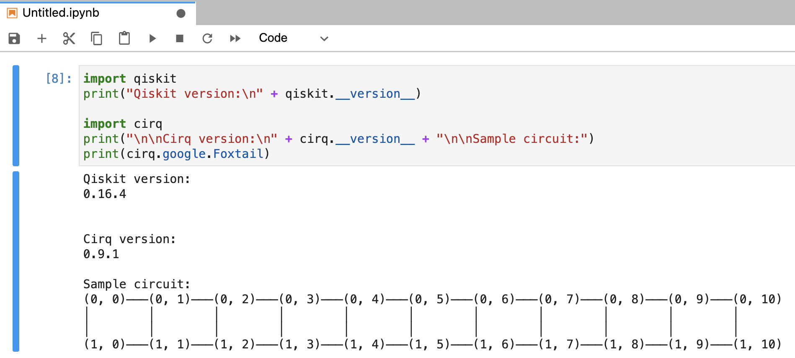
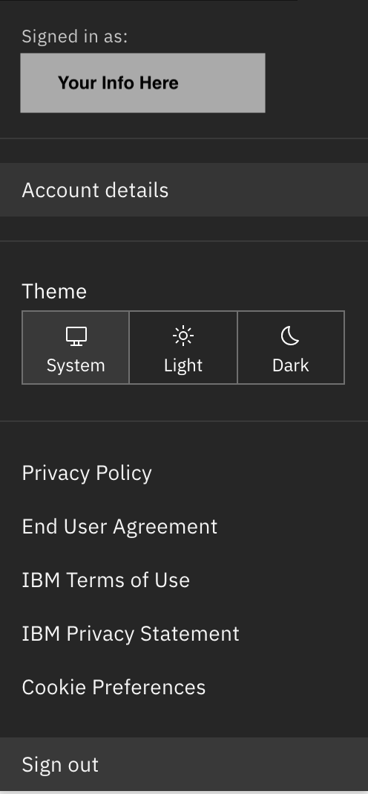
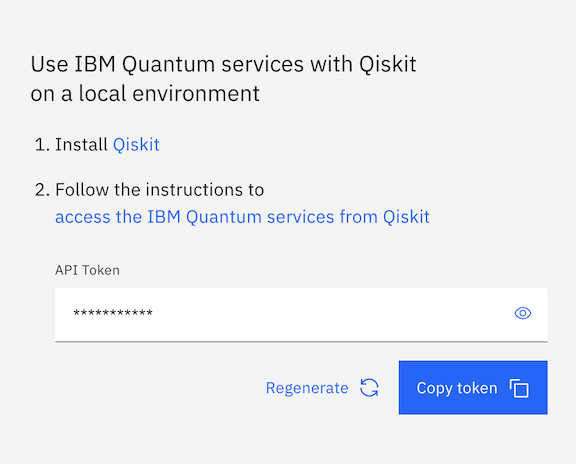
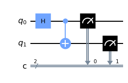
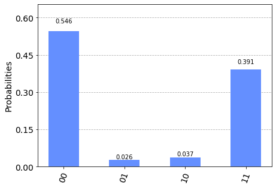

# Environment Setup Guide
This guide assumes a basic familiarity with the command line or terminal and the ability to understand and execute simple Python scripts. Following the recommended installation path should take approximately 15 minutes before being able to use Qiskit to build and submit a simple "hello world" example circuit for execution on a real quantum computer.

## Recommended Setup Process With Anaconda
The easiest way to install everything needed for quantum simulation is to use Anaconda or Miniconda. The [Anaconda installation guide](https://docs.anaconda.com/anaconda/install/) should be followed for your particular operating system first. If using Windows, we recommend selecting the top checkbox to add Anaconda to your PATH.

**WINDOWS NOTES:** When installing on Windows, you will need to download and install the [Visual C++ Build Tools](https://visualstudio.microsoft.com/visual-cpp-build-tools/) in order for the environment to build successfully. Once this installation has completed and Anaconda has been installed, you will then need to run the command `conda install pywin32`. After these steps have been completed, the remaining steps should work correctly. If the steps below still do not work, we recommend following the manual installation steps at the end of this document.

Once Anaconda has been successfully installed, download this [environment.yml](Resources/environment.yml) file and run the command
```
conda env create -f environment.yml
```
from the directory where it was downloaded to create the `quantum_fun` environment on your system. This will install everything necessary for development with Qiskit and Cirq using Jupyter Lab. The process may take a few minutes depending on your connection speed, and might be a good time to [register for an IBM Quantum Experience account](https://quantum-computing.ibm.com/login). After Anaconda has downloaded all of the packages, you will receive a message similar to the following
```
done
#
# To activate this environment, use
#
#     $ conda activate quantum_fun
#
# To deactivate an active environment, use
#
#     $ conda deactivate
```
Next, run the command to activate the environment
```
conda activate quantum_fun
```
and then launch Jupyter Lab with the command
```
jupyter-lab
```
This should bring up a browser window pointed at http://localhost:8888/lab with shortcuts to create a Python 3 Notebook, a terminal, and several other choices.



Select the Python 3 Notebook, and enter the following in the first box:
```python
import qiskit
print("Qiskit version:\n" + qiskit.__version__)

import cirq
print("\n\nCirq version:\n" + cirq.__version__ + "\n\nSample circuit:")
print(cirq.google.Foxtail)
```
Press the play button and you should receive output like the below:



You're all set and ready to start developing quantum applications locally! Continue on to integrate with the IBM Quantum Experience for Qiskit and run your first application

#### Useful Anaconda Commands
* To deactivate the environment after use: `conda deactivate`
* To list available environments: `conda info --envs`
* To remove and environment entirely: `conda remove --name myenv --all`

For additional information, the [getting started guide](https://docs.conda.io/projects/conda/en/latest/user-guide/getting-started.html) is excellent, but should not be necessary for this project.

## Integrating with IBM Quantum Experience
*Note:* This portion of the guide condenses information found in the Qiskit documentation, including [Installing Qiskit](https://qiskit.org/documentation/install.html) and [Getting Started](https://qiskit.org/documentation/getting_started.html), as well as various pages in the [API documentation](https://qiskit.org/documentation/apidoc/ibmq-provider.html).

IBM developed the Qiskit framework, and makes it simple to integrate with their free cloud-connected quantum computers for the execution of simple circuits. The free hardware available consists of 8 machines with 1 to 15 qubits and quantum volumes between 1 and 32. A 32 qubit wavefunction simulator is available as well. IBM has paid offerings with qubit counts up to 65 and quantum volume up to 128, but those will not be used by this project.

To access the IBM Quantum Experience, first [register for an account](https://quantum-computing.ibm.com/login) and sign in. This web interface provides functionality for composing and executing circuits and is more than adequate for basic investigation into quantum computing. After completing registration, navigate to the user menu in the upper right corner of the window and select "Account details".



On the right side of next screen, you should see a box with an API Token and a copy button.



Press the "Copy token" button to copy the 512-bit API token. Launch Jupyter Lab from a terminal with the command `jupyter-lab` or navigate to http://localhost:8888/lab if it is already running from the previous step. In a new Python notebook, enter the following commands, replacing the string with your copied API token, and press the play button to execute them:
```python
from qiskit import IBMQ
IBMQ.save_account('Paste_your_API_token_here_1a2b3c_etc')
```
This will save your credentials into a configuration file in `$USER_HOME/.qiskit/qiskitrc` by default. It also allows you to reload these credentials at any time by including the commands
```python
from qiskit import IBMQ
IBMQ.load_account()
```
in a script. At this point you are ready to run a sample circuit in a local simulator and on a quantum computer.

### Sample Circuit Execution
For reference, the code from the following section is also available in a Jupyter notebook which can be found at [Qiskit-Demo.ipynb](Qiskit-Demo.ipynb).

Create a new Python 3 notebook in Jupyter Lab, and enter the following code from Qiskit's [getting started](https://qiskit.org/documentation/getting_started.html) document in the first cell and execute it with the play button:
```python
iimport numpy as np
from qiskit import(QuantumCircuit, execute, Aer, IBMQ, assemble, transpile)
from qiskit.visualization import plot_histogram
from qiskit.providers.ibmq.job import job_monitor

# Use Aer's qasm_simulator
simulator = Aer.get_backend('qasm_simulator')

# Create a Quantum Circuit acting on the q register
circuit = QuantumCircuit(2, 2)

# Add a H gate on qubit 0
circuit.h(0)

# Add a CX (CNOT) gate on control qubit 0 and target qubit 1
circuit.cx(0, 1)

# Map the quantum measurement to the classical bits
circuit.measure([0,1], [0,1])

# Execute the circuit on the qasm simulator
job = execute(circuit, simulator, shots=1000)

# Grab results from the job
result = job.result()

# Returns counts
counts = result.get_counts(circuit)
print("\nTotal count for 00 and 11 are:",counts)

# Draw the circuit
circuit.draw()
```

This will create a simple circuit that produces an entangled Bell pair, run it 1000 times in a local quantum simulator, and then print the counts and draw the circuit. On completion, you should receive output similar to the following: \
`Total count for 00 and 11 are: {'00': 495, '11': 505}` \


Next, we can execute the same circuit on a real quantum computer. In a new cell in the notebook, enter the following to load your IBM Quantum account, and list the available backends:
```python
provider = IBMQ.load_account()
provider.backends()
```

The `load_account` command may produce a warning about timestamps, but this can be ignored. The `provider.backends()` command will print a list of the quantum computers and simulators available through the quantum experience like the following:
```
[<IBMQSimulator('ibmq_qasm_simulator') from IBMQ(hub='ibm-q', group='open', project='main')>,
 <IBMQBackend('ibmqx2') from IBMQ(hub='ibm-q', group='open', project='main')>,
 <IBMQBackend('ibmq_16_melbourne') from IBMQ(hub='ibm-q', group='open', project='main')>,
 <IBMQBackend('ibmq_armonk') from IBMQ(hub='ibm-q', group='open', project='main')>,
 <IBMQBackend('ibmq_athens') from IBMQ(hub='ibm-q', group='open', project='main')>,
 <IBMQBackend('ibmq_santiago') from IBMQ(hub='ibm-q', group='open', project='main')>,
 <IBMQBackend('ibmq_lima') from IBMQ(hub='ibm-q', group='open', project='main')>,
 <IBMQBackend('ibmq_belem') from IBMQ(hub='ibm-q', group='open', project='main')>,
 <IBMQBackend('ibmq_quito') from IBMQ(hub='ibm-q', group='open', project='main')>]
```
Details about each of these systems can be viewed on the [Quantum Services](https://quantum-computing.ibm.com/systems?systems=yours) page in the IBM Quantum Experience. Any that are indicated by `IBMQBackend` are real quantum computers, though some like `ibmq_armonk` only have a single qubit available. For this document we will use `ibmq_lima`, though any of the others with more than one qubit would be suitable as well.

In another cell on the notebook, enter the following to process your circuit for the specific quantum computer on which it will be executed, and then queue a job and monitor its status:
```python
backend = provider.backends.ibmq_lima
qobj = assemble(transpile(circuit, backend=backend), backend=backend)
job = backend.run(qobj)
retrieved_job = backend.retrieve_job(job.job_id())
job_monitor(retrieved_job, 30)
```

The job monitor will update periodically, and after a minute or so will provide an ETA: `Job Status: job is queued (42) [Est. wait time: 57 min 44 sec]`. Note that jobs submitted to the IBMQ backend can also be [monitored on the jobs page online](https://quantum-computing.ibm.com/jobs). Once the job monitor reports `Job Status: job has successfully run`, enter the following to retrieve and visualize the results:
```python
result = retrieved_job.result()
counts = result.get_counts(circuit)
print("\nTotal count for 00 and 11 are:",counts)
plot_histogram(counts)
```

On a perfect quantum circuit, we would expect to see only the states 00 and 11 measured for this particular circuit. Due to noise, calibration errors, hardware bias, etc., the measured outcomes will likely look more like the following:



Congratulations! You've just run your first quantum program on a real quantum computer.

### Additional Learning
After completing this installation and running the simple circuit above, an excellent next step is the [Qiskit tutorial](https://quantum-computing.ibm.com/lab/files/qiskit-tutorials/start_here.ipynb) on IBM's Quantum Lab, which walks through a large number of examples and goes into extensive detail on some more advanced circuit building concepts. The [Qiskit Textbook](https://qiskit.org/textbook/preface.html) also provides excellent examples of quantum algorithms, as well as more in-depth explanation of some of the concepts behind quantum computing.

***

## Setting Up Individual Components (Advanced)
This section is intended for the user who wants to customize everything and potentially read a lot of documentation in the process. This portion of the guide assumes you know what you're doing, are avoiding Anaconda for a good reason, and can work through any issues that arise while installing these components.

### Python
Check your installed version of Python from a command prompt with the command
```
python --version
```
Python 2 comes preinstalled with OS X and most Linux distributions, but Python 3 usually has to be installed separately. Follow the instructions to download and install Python for your operating system from [python.org](https://www.python.org/downloads/)

Check if Pip is installed by running
```
python -m pip --version
```
This should be the case if you downloaded the latest version of Python. Otherwise, follow the instructions at [the Pip website](https://pip.pypa.io/en/stable/installing/) to install the package manager.

### Qiskit
Install qiskit by running the command `pip install qiskit`. Verify that the install was successful by running `python -c 'import qiskit; print(qiskit.__version__)'` and verifying that it prints a version number (`0.16.4` as of March 1st, 2021) as output.

Optionally, in `$USER_HOME/.qiskit/` create a file `settings.conf` and add the following lines:
```
[default]
circuit_drawer = mpl
```
This will set your installation to use MatPlotLib by default for circuit drawings instead of the default text-based rendering.

Additional installation and setup instructions can be found [here](https://qiskit.org/documentation/install.html).

### Cirq
While we don't currently plan to use Cirq, installation is equally simple with pip and just requires the command `pip install cirq`. Verify that Cirq was installed correctly by running the command `python -c 'import cirq; print(cirq.google.Foxtail)'` (may need double quotes on Windows) and verifying that it prints a circuit as output.

Additional installation and setup instructions can be found [here](https://github.com/quantumlib/Cirq/blob/master/docs/install.md) if necessary. Tutorials for Cirq and additional information can be found [on Google's Quantum homepage](https://quantumai.google/).

### Jupyter Lab
Install Jupyter Lab by running the command `pip install jupyterlab`, then verify that the install was successful by running `jupyter-lab`. A blank document should appear like this:


Additional installation and setup instructions can be found [here](https://jupyter.org/install) if needed.
